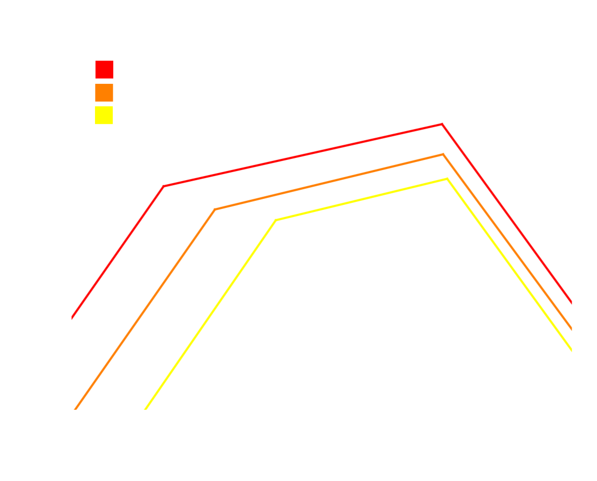
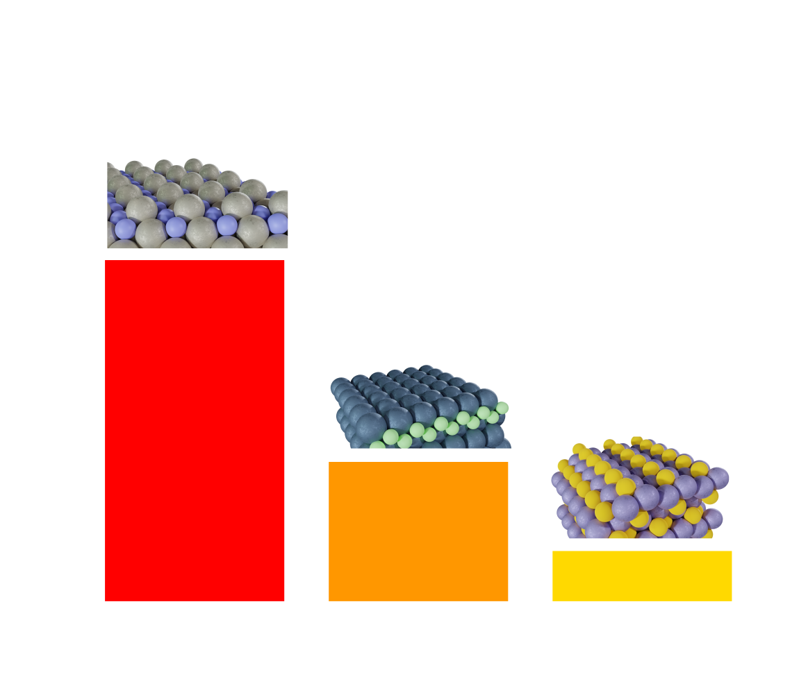
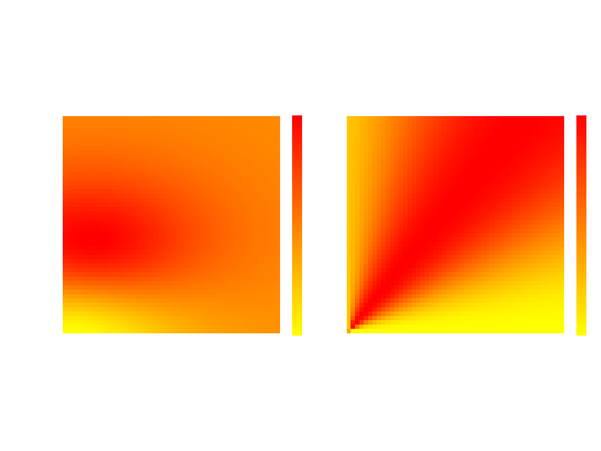
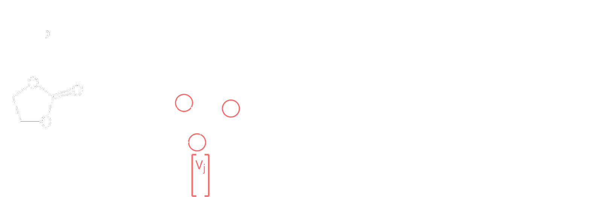

## Electrocatalytic Scaling Relations
I combine physcial simulations of electrochemical systems with thermodynamic proxies of catalyst activity to screen broad material spaces for active catalysts. Typical electrocatalyst theoretical studies are done using the computational hydrogen electrode (CHE) model, in which the number of electrons transferred in a step is assumed a-priori and must be coupled to simulataneous proton transfers. Following the definition of the standard hydrogen electrode, one can set the chemical potential of a proton-electron pair equal to one half that of a hydrogen atom.
$$ G_{H^+} + G_{e^-} = -\frac{1}{2} G_{H_2} $$
The free energy of the proton is potential-independent and the potential dependence of the electron is given by the potential with respect to the standard hydrogen electrode (SHE). 
$$ G_{e^-} = G_{e^-}^0 - U_{SHE} $$
This then allows one to estimate the [Limiting Potential](https://chemistry-europe.onlinelibrary.wiley.com/doi/abs/10.1002/cssc.201500322), $U_L$ at which an electrochemical step becomes favorable by dividing the free energy change of that step by the number
of electrons transferred.
$$ U_{L} = -\frac{\Delta G_{step}}{N_{e}} $$
This approach has been widely successful in predicting electrocatalyst activity across a variety of reactions. [\[1\]](https://pubs.acs.org/doi/10.1021/jp047349j) [\[2\]](https://chemistry-europe.onlinelibrary.wiley.com/doi/abs/10.1002/cssc.201500322) [\[3\]](https://iopscience.iop.org/article/10.1149/1.1856988)

However, the CHE model cannot handle non proton-coupled electron transfer steps and enforces an integer number of electrons transferred in each step. For many reactions, there is significant evidence of fractional electron transfers as well as electron transfers that are not coupled to proton transfers. [\[4\]](https://pubs.acs.org/doi/abs/10.1021/acscatal.2c01832) To capture these phenomena, it is necessary to simulate the system at fixed electron potential and allow the number of electrons to self-consistently vary. I perform these simulations using Grand Canonical DFT (GC-DFT), which allows me to study systems under true fixed potentials.

Using GC-DFT takes away the easy interpretability of $U_{L}$ and requires a different catalyst activity descriptor that has no formal potential dependence. I developed $\Phi_{max}$, a thermodynamic approximation of the 
[energetic span](https://pubs.acs.org/doi/10.1021/ar1000956), which measures the largest barrier in a catalytic cycle. I used this descriptor to re-evaluate the typical CHE volcano plots for the electrochemical nitrogen reduction reaction to understand how explicit inclusion of potential changes catalyst scaling relations.[\[5\]](https://pubs.acs.org/doi/abs/10.1021/acscatal.3c01978)

## Electrocatalyst Screening
Using the scaling relations developed above, I screened a material space for promising nitrogen reduction catalysts. This space consisted of binary metal-covalent alloys that combined p-block dopants with transition metals. We found that even the most active catalysts in our dataset did not surpass the the activity of the most active metal catalysts because these covalent alloy materials fail to favorably break scaling relations.[\[6\]](https://onlinelibrary.wiley.com/doi/abs/10.1002/aenm.202304559)

Furthermore, we found that traditional electronic structure descriptors like d-band and p-band centers were unable to predict trends in binding energy across the dataset. We believe this is due to the highly geometry-dependent change in the renormalized adsorbate frontier orbital energies, which lead to substantially different degrees of bonding for materials with similar d-band centers. To correctly precict trends in binding energy across complex material spaces, it is necessary to incorporate the geometry of the surface.

## Battery Electrolyte Composition Optimization
I have recently begun working with [Chunmei Ban](https://www.colorado.edu/lab/ban/) on optimizing experimental electrolyte compositions for Na-ion batteries. I have succesfully implemented information theoretic and simple expected improvement acquisiton functions on top of a gaussian process surrogate model to efficiently explore compositions experimentally. However, the design space for electrolyte compositions is huge and experiments are expensive. 

I am currently working on incorporating molecular features into the model using graph neural networks to featurize molecular structures and attention mechanisms to create mixture level representations from the constituent molecular features. [7](https://arxiv.org/abs/2312.16473) The architecture of the model is visualized as
